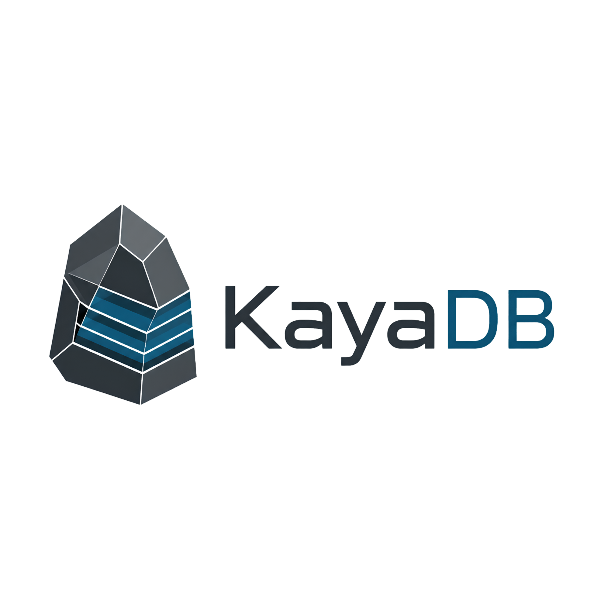

# KayaDB distributed key-value storage engine

<div align="center">



[](https://github.com/Tuntii/KayaDB/actions/workflows/ci.yml)
[](LICENSE-MIT)
[](Cargo.toml)
[](https://crates.io/crates/kaya-engine)
[](https://crates.io/crates/kayactl)
[](https://tuntii.github.io/KayaDB/#/ROADMAP.md)
[](https://tuntii.github.io/KayaDB/)

**A correctness-first, embeddable distributed key-value database built in Rust.**

_KayaDB is the database for people who believe crashes should be test cases, not horror stories._

</div>

## 📚 Documentation

**The complete documentation is published on GitHub Pages**:

→ **[https://tuntii.github.io/KayaDB/](https://tuntii.github.io/KayaDB/)**

It includes:
- Installation (crates.io, release binaries, build from source)
- Getting started, CLI reference, and runbooks
- Architecture, specifications (WAL, LSM, recovery, Raft…)
- Correctness testing (SimDisk, Jepsen, chaos-matrix CI)
- Deployment (Docker, Kubernetes), CI/Actions setup, security, releases, roadmap

Sources live in `docs/` (Docsify on GitHub Pages; `SUMMARY.md` kept for GitBook compatibility).

---

**Quick links in this README:**
- [Install](#install)
- [Why KayaDB exists](#why-kayadb-exists)
- [Quick start](#quick-start) — 60-second `kayactl` path, then from-source cluster
- [Feature snapshot](#feature-snapshot)
- [Releases](docs/releases.md) · [Roadmap](ROADMAP.md) · [Contributing](CONTRIBUTING.md)

---

## Why KayaDB exists

KayaDB is an open-source storage engine and distributed key-value database prototype designed around a simple thesis:

> **If a storage bug cannot be reproduced, inspected, and turned into an invariant, it is not really fixed.**

The project combines an LSM-tree storage engine, a write-ahead log, deterministic disk fault injection (`SimDisk`), a replayable simulator, a Raft prototype, a TCP server, an async Rust client, and an operator CLI — all inside one intentionally small Rust workspace.

**Full documentation:** [docs/README.md](docs/README.md) · [Installation](docs/installation.md) · [Getting started](docs/getting-started.md)

This README is a high-level overview. Deep dives live on the docs site.

---

## Install

```bash
# CLI + embedded mode (no server needed)
cargo install kayactl

# Server binary
cargo install kaya-server --bin kayadb-server
```

After `cargo install kayactl`, you can `put` / `get` / `inspect` without cloning — [try it in 60 seconds](#try-it-in-60-seconds).

Pre-built binaries: [GitHub Releases](https://github.com/Tuntii/KayaDB/releases) (`v0.1.113` and later).  
Rust library: `kaya-engine = "0.1.113"` — see [installation guide](docs/installation.md).

---

## Feature snapshot

| Area | Status | Notes |
|---|---:|---|
| Write-ahead log | ✅ Implemented | CRC32C-protected records, append, recovery, inspection |
| LSM storage | ✅ Implemented | Memtable, SSTable, manifest, flush, L0 compaction |
| Crash recovery | ✅ Implemented | Durable-prefix recovery, tail truncation, idempotence tests |
| Deterministic disk faults | ✅ Implemented | `SimDisk`, `FaultSchedule`, replayable operation ordering |
| Simulator | ✅ Implemented | Seeded workloads, trace replay, reference-model checks |
| Fuzz targets | ✅ Implemented | WAL, SSTable, manifest, server command frame decoders |
| Raft state machine | ✅ Implemented | Election, AppendEntries, snapshots, joint-consensus membership |
| TCP cluster mode | ✅ Implemented | Multi-raft ranges, leader-routed ops, TLS + token auth |
| Async Rust client | ✅ Implemented | `kaya-client` with redirect, TXN, range, CDC, retries |
| Operator CLI | ✅ Implemented | Local/server mode, inspect, range, index, backup, membership |
| Production hardening | ✅ M13–M24 | TLS, tokens, ACL, encryption-at-rest, runbooks, chaos gates |
| Distributed TXN KV | ✅ M16–M25 | MVCC, SI, 2PC, indexes, CDC, range split/merge (v0.2.0 candidate) |

> **v0.1.113** closes the **M16–M25 production path** (range-sharded multi-raft KV, SI + sequential cross-range 2PC, encryption, ACL, Go/Python/TS clients). It is a **v0.2.0 candidate**, not an unqualified production-SLA claim — residual risks (live range migrate) are listed in [ROADMAP.md](ROADMAP.md). Range meta is Raft-replicated + disk-backed (#25); encryption key rotation is online, dual-key-window based (#28). See [security](docs/security.md) §7 before any production-like deployment.

---

## Quick start

### Try it in 60 seconds

No clone required. `kayactl` opens an embedded engine against a data directory:

```bash
cargo install kayactl

kayactl --data ./demo put hello world
kayactl --data ./demo get hello
kayactl --data ./demo inspect wal ./demo/wal-000001.wal
```

That is the whole loop: write, read, inspect the WAL. Need the server binary too? `cargo install kaya-server --bin kayadb-server`. Other install options (release binaries, TLS) live in the [installation guide](docs/installation.md).

### From source: workspace and cluster

Clone the repo when you want to run the test suite, start a local cluster, or hack on the engine.

#### Requirements

- Rust 1.85 or newer
- Cargo
- Linux, macOS, or Windows for development

#### Build and test

```bash
git clone https://github.com/Tuntii/KayaDB.git
cd KayaDB

cargo build --workspace
cargo test --workspace
```

CI gates on:

```bash
cargo fmt --all -- --check
cargo clippy --workspace --all-targets -- -D warnings
cargo test --workspace
```

#### Use KayaDB locally without a server

From the workspace, `kayactl` can open an embedded engine directly against a data directory:

```bash
cargo run -p kayactl -- --data ./.kayadb-demo put hello world
cargo run -p kayactl -- --data ./.kayadb-demo get hello
cargo run -p kayactl -- --data ./.kayadb-demo scan he
cargo run -p kayactl -- --data ./.kayadb-demo stats
cargo run -p kayactl -- --data ./.kayadb-demo recover --dry-run
```

#### Run a single-node server

In one terminal:

```bash
cargo run -p kaya-server --bin kayadb-server -- --data ./.kaya-node1 --raft-addr 127.0.0.1:7481 --client-addr 127.0.0.1:7379
```

In another terminal:

```bash
cargo run -p kayactl -- --server 127.0.0.1:7379 put hello world
cargo run -p kayactl -- --server 127.0.0.1:7379 get hello
cargo run -p kayactl -- --server 127.0.0.1:7379 status
```

#### Run a three-node local cluster

Start one command per terminal:

```bash
cargo run -p kaya-server --bin kayadb-server -- --node-id 1 --raft-addr 127.0.0.1:7481 --client-addr 127.0.0.1:7379 --peer 2=127.0.0.1:7482,127.0.0.1:7380 --peer 3=127.0.0.1:7483,127.0.0.1:7381 --data ./.kaya-node1
```

```bash
cargo run -p kaya-server --bin kayadb-server -- --node-id 2 --raft-addr 127.0.0.1:7482 --client-addr 127.0.0.1:7380 --peer 1=127.0.0.1:7481,127.0.0.1:7379 --peer 3=127.0.0.1:7483,127.0.0.1:7381 --data ./.kaya-node2
```

```bash
cargo run -p kaya-server --bin kayadb-server -- --node-id 3 --raft-addr 127.0.0.1:7483 --client-addr 127.0.0.1:7381 --peer 1=127.0.0.1:7481,127.0.0.1:7379 --peer 2=127.0.0.1:7482,127.0.0.1:7380 --data ./.kaya-node3
```

Then talk to any node. If the contacted node knows the leader, `kayactl` and `kaya-client` can follow the redirect:

```bash
cargo run -p kayactl -- --server 127.0.0.1:7379 put user:1 ada
cargo run -p kayactl -- --server 127.0.0.1:7380 get user:1
cargo run -p kayactl -- --server 127.0.0.1:7381 status --json
```

For a longer walkthrough, see [`docs/getting-started.md`](docs/getting-started.md).

---

## Use it as a Rust library

### Embedded engine

Use `kaya-engine` when you want the storage engine in-process:

```rust
use std::sync::Arc;

use kaya_core::{DurabilityMode, EngineConfig};
use kaya_engine::{Engine, ReadOptions, WriteOptions};
use kaya_io::FileDisk;

#[tokio::main]
async fn main() -> Result<(), Box<dyn std::error::Error>> {
    let data_dir = std::env::temp_dir().join("kayadb_embedded_example");
    let config = EngineConfig {
        data_dir: data_dir.clone(),
        ..EngineConfig::default()
    };
    let disk = Arc::new(FileDisk::new(data_dir));
    let mut engine = Engine::open(config, disk).await?;

    engine
        .put(
            b"hello".to_vec(),
            b"world".to_vec(),
            WriteOptions {
                durability: Some(DurabilityMode::Strict),
                idempotency_key: None,
            },
        )
        .await?;

    let value = engine.get(b"hello", ReadOptions::default()).await?;
    assert_eq!(value.as_deref(), Some(&b"world"[..]));

    Ok(())
}
```

See [`crates/kaya-engine/examples/embedded.rs`](crates/kaya-engine/examples/embedded.rs).

### TCP client

Use `kaya-client` when your application talks to a running server:

```rust
use std::net::SocketAddr;

use kaya_client::KayaClient;

#[tokio::main]
async fn main() -> Result<(), Box<dyn std::error::Error>> {
    let addr: SocketAddr = "127.0.0.1:7379".parse()?;
    let mut client = KayaClient::connect(addr).await?;

    client.put(b"hello", b"world").await?;

    if let Some(value) = client.get(b"hello").await? {
        println!("{}", String::from_utf8_lossy(&value));
    }

    Ok(())
}
```

See [`crates/kaya-client/examples/`](crates/kaya-client/examples/).

---

## Architecture & Testing

For the full architecture, crate map, data flows, write/read paths, and design decisions, see the **[Architecture chapter in the documentation](docs/architecture.md)**.

KayaDB emphasizes **design-first + correctness-first** development:

- All persistent formats are inspectable via `kayactl inspect`
- The same engine code runs against real `FileDisk` and deterministic `SimDisk`
- Extensive use of seeded simulation, trace replay, crash/recovery idempotence tests, and fuzzing

See:
- [Development & Testing Guide](docs/development.md)
- [Jepsen-style testing design](docs/jepsen-design.md)
- [Full technical specifications](docs/README.md#full-documentation-structure)

---

## Inspectability & Performance

Inspect any on-disk artifact:

```bash
kayactl inspect wal ./data/wal-000001.wal
kayactl inspect sstable ./data/sst-000001.sst
kayactl --data ./data recover --dry-run --json
```

Benchmark suite (Criterion):

```bash
cargo bench -p kaya-bench
```

Detailed numbers and methodology live in [BENCHMARKS.md](BENCHMARKS.md).

---

## Current Status & Limitations

See the **[full status and roadmap](ROADMAP.md)** and the tracked **[productization north star](docs/productization.md)** (M13 exit gates — prototype → deployable product).

**Current line:** `v0.1.113` (M16–M25 production path; **v0.2.0 candidate**). Earlier milestones: M13 productization, M14 algorithms + Jepsen full gate, M15 auth/ops/clients/deploy. Honest residuals and next cut priorities: [ROADMAP.md](ROADMAP.md). Accepted risks: [security.md §7](docs/security.md#7-accepted-risks-and-future-hardening-m15-exit).

For the complete picture, use the **[official documentation](https://tuntii.github.io/KayaDB/)** or [docs/README.md](docs/README.md).

---

## Contributing

KayaDB is open source and contributor-friendly, but correctness culture is non-negotiable.

- Please read [CONTRIBUTING.md](CONTRIBUTING.md) before submitting changes.
- We follow the [Contributor Covenant Code of Conduct](CODE_OF_CONDUCT.md).
- Security vulnerabilities: see [.github/SECURITY.md](.github/SECURITY.md).

Run the full checks locally before pushing:

```bash
cargo fmt --all -- --check
cargo clippy --workspace --all-targets -- -D warnings
cargo test --workspace
```

Good first areas are listed inside `CONTRIBUTING.md`.

---

## License

KayaDB is dual-licensed under **MIT OR Apache-2.0**.

- [LICENSE-MIT](LICENSE-MIT)
- [LICENSE-APACHE](LICENSE-APACHE)

You may choose either license when using or contributing to the project.

---

<div align="center">

**KayaDB: make the storage layer explain itself.**

If this project interests you, star it, break it, replay it, and send the invariant back as a PR.

</div>