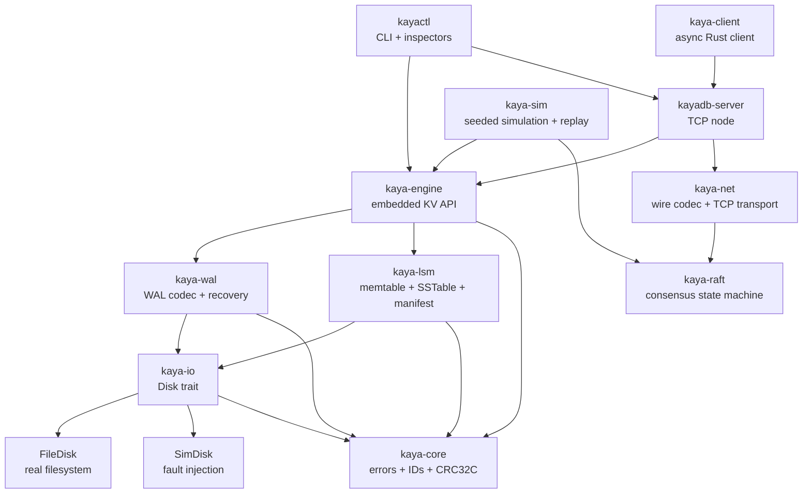

# KayaDB

<div align="center">


[](https://github.com/Tuntii/KayaDB/actions/workflows/ci.yml)
[](Cargo.toml)
[](Cargo.toml)
[](ROADMAP.md)

**A correctness-first, inspectable, embeddable storage engine built in Rust.**

_KayaDB is the database project for people who believe crashes should be test cases, not horror stories._

[Docs](docs/README.md) · [Getting started](docs/getting-started.md) · [Architecture](docs/architecture.md) · [CLI reference](docs/cli-reference.md) · [Security](docs/security.md) · [Roadmap](ROADMAP.md)

</div>

---

## Why KayaDB exists

KayaDB is an open-source storage engine and distributed key-value database prototype designed around a simple thesis:

> **If a storage bug cannot be reproduced, inspected, and turned into an invariant, it is not really fixed.**

The project combines an LSM-tree storage engine, a write-ahead log, deterministic disk fault injection, a replayable simulator, a Raft prototype, a TCP server, an async Rust client, and an operator CLI — all inside one intentionally small Rust workspace.

KayaDB is not trying to be “yet another black-box database”. It is built to be opened, inspected, broken on purpose, replayed from a seed, and improved in public.

---

## What makes it different

### 1. Deterministic crashes with the same engine code

Most projects test happy paths first and crash paths later. KayaDB flips that priority.

The entire storage stack talks to a `Disk` trait. In normal runs, that trait is backed by `FileDisk`. In tests and simulations, the same engine code runs on `SimDisk`, an in-memory disk that models volatile bytes, stable bytes, `fsync`, partial writes, dropped writes, I/O errors, and crash recovery.

```text
kaya-engine
   ├─ kaya-wal
   ├─ kaya-lsm
   └─ kaya-io::Disk
        ├─ FileDisk  → real filesystem + fsync
        └─ SimDisk   → deterministic fault injection + crash replay
```

That means storage failures are not vague CI flakes. They can become reproducible seeds, JSONL traces, and regression tests.

### 2. Inspectable persistent formats

KayaDB treats every byte written to disk as something operators and contributors should be able to understand.

`kayactl` can inspect:

- WAL segments,
- SSTables,
- manifests,
- recovery reports,
- engine and cluster status.

No hidden “trust me bro” file formats. If KayaDB writes it, the project aims to give you a way to inspect it.

### 3. Design-first development

Persistent formats, recovery semantics, testing rules, CLI UX, security boundaries, and roadmap decisions are documented before they become hard to change.

The north star is not “ship more code”. It is:

- define the invariant,
- implement the smallest correct mechanism,
- prove it with deterministic tests,
- expose enough tooling to debug it when it fails.

### 4. Embeddable engine and networked server

KayaDB can be used in two modes:

- **Embedded** — use `kaya-engine` directly inside a Rust process.
- **Server / cluster** — run `kayadb-server` and connect with `kayactl` or `kaya-client` over TCP.

The project is deliberately modular, so storage, networking, consensus, simulation, and CLI code can be studied independently.

---

## Feature snapshot

| Area | Status | Notes |
|---|---:|---|
| Write-ahead log | ✅ Implemented | CRC32C-protected records, append, recovery, inspection |
| LSM storage | ✅ Implemented | Memtable, SSTable, manifest, flush, L0 compaction |
| Crash recovery | ✅ Implemented | Durable-prefix recovery, tail truncation, idempotence tests |
| Deterministic disk faults | ✅ Implemented | `SimDisk`, `FaultSchedule`, replayable operation ordering |
| Simulator | ✅ Implemented | Seeded workloads, trace replay, reference-model checks |
| Fuzz targets | ✅ Implemented | WAL, SSTable, manifest, server command frame decoders |
| Raft state machine | ✅ Prototype | Election, AppendEntries, commit index, simulation coverage |
| TCP cluster mode | ✅ Prototype | Static membership, leader-routed client operations |
| Async Rust client | ✅ Implemented | `kaya-client` with leader redirection support |
| Operator CLI | ✅ Implemented | Local mode, server mode, inspect, stats, dry-run recovery |
| Production hardening | 🚧 Planned | TLS/auth, dynamic membership, snapshots, Jepsen, eBPF |

> KayaDB is experimental. It is a serious systems project, but not yet a production database. See [security and deployment notes](docs/security.md) before exposing anything outside localhost.

---

## Quick start

### Requirements

- Rust 1.85 or newer
- Cargo
- Linux, macOS, or Windows for development

### Build and test

```bash
git clone https://github.com/Tuntii/KayaDB.git
cd KayaDB

cargo build --workspace
cargo test --workspace
```

CI gates on:

```bash
cargo fmt --all -- --check
cargo clippy --workspace --all-targets -- -D warnings
cargo test --workspace
```

### Use KayaDB locally without a server

`kayactl` can open an embedded engine directly against a data directory:

```bash
cargo run -p kayactl -- --data ./.kayadb-demo put hello world
cargo run -p kayactl -- --data ./.kayadb-demo get hello
cargo run -p kayactl -- --data ./.kayadb-demo scan he
cargo run -p kayactl -- --data ./.kayadb-demo stats
cargo run -p kayactl -- --data ./.kayadb-demo recover --dry-run
```

### Run a single-node server

In one terminal:

```bash
cargo run -p kaya-server --bin kayadb-server -- --data ./.kaya-node1 --raft-addr 127.0.0.1:7481 --client-addr 127.0.0.1:7379
```

In another terminal:

```bash
cargo run -p kayactl -- --server 127.0.0.1:7379 put hello world
cargo run -p kayactl -- --server 127.0.0.1:7379 get hello
cargo run -p kayactl -- --server 127.0.0.1:7379 status
```

### Run a three-node local cluster

Start one command per terminal:

```bash
cargo run -p kaya-server --bin kayadb-server -- --node-id 1 --raft-addr 127.0.0.1:7481 --client-addr 127.0.0.1:7379 --peer 2=127.0.0.1:7482,127.0.0.1:7380 --peer 3=127.0.0.1:7483,127.0.0.1:7381 --data ./.kaya-node1
```

```bash
cargo run -p kaya-server --bin kayadb-server -- --node-id 2 --raft-addr 127.0.0.1:7482 --client-addr 127.0.0.1:7380 --peer 1=127.0.0.1:7481,127.0.0.1:7379 --peer 3=127.0.0.1:7483,127.0.0.1:7381 --data ./.kaya-node2
```

```bash
cargo run -p kaya-server --bin kayadb-server -- --node-id 3 --raft-addr 127.0.0.1:7483 --client-addr 127.0.0.1:7381 --peer 1=127.0.0.1:7481,127.0.0.1:7379 --peer 2=127.0.0.1:7482,127.0.0.1:7380 --data ./.kaya-node3
```

Then talk to any node. If the contacted node knows the leader, `kayactl` and `kaya-client` can follow the redirect:

```bash
cargo run -p kayactl -- --server 127.0.0.1:7379 put user:1 ada
cargo run -p kayactl -- --server 127.0.0.1:7380 get user:1
cargo run -p kayactl -- --server 127.0.0.1:7381 status --json
```

For a longer walkthrough, see [`docs/getting-started.md`](docs/getting-started.md).

---

## Use it as a Rust library

### Embedded engine

Use `kaya-engine` when you want the storage engine in-process:

```rust
use std::sync::Arc;

use kaya_core::{DurabilityMode, EngineConfig};
use kaya_engine::{Engine, ReadOptions, WriteOptions};
use kaya_io::FileDisk;

#[tokio::main]
async fn main() -> Result<(), Box<dyn std::error::Error>> {
    let data_dir = std::env::temp_dir().join("kayadb_embedded_example");
    let config = EngineConfig {
        data_dir: data_dir.clone(),
        ..EngineConfig::default()
    };
    let disk = Arc::new(FileDisk::new(data_dir));
    let mut engine = Engine::open(config, disk).await?;

    engine
        .put(
            b"hello".to_vec(),
            b"world".to_vec(),
            WriteOptions {
                durability: Some(DurabilityMode::Strict),
                idempotency_key: None,
            },
        )
        .await?;

    let value = engine.get(b"hello", ReadOptions::default()).await?;
    assert_eq!(value.as_deref(), Some(&b"world"[..]));

    Ok(())
}
```

See [`crates/kaya-engine/examples/embedded.rs`](crates/kaya-engine/examples/embedded.rs).

### TCP client

Use `kaya-client` when your application talks to a running server:

```rust
use std::net::SocketAddr;

use kaya_client::KayaClient;

#[tokio::main]
async fn main() -> Result<(), Box<dyn std::error::Error>> {
    let addr: SocketAddr = "127.0.0.1:7379".parse()?;
    let mut client = KayaClient::connect(addr).await?;

    client.put(b"hello", b"world").await?;

    if let Some(value) = client.get(b"hello").await? {
        println!("{}", String::from_utf8_lossy(&value));
    }

    Ok(())
}
```

See [`crates/kaya-client/examples/`](crates/kaya-client/examples/).

---

## Architecture



### Workspace map

| Crate | Purpose |
|---|---|
| [`kaya-core`](crates/kaya-core/README.md) | Shared errors, typed IDs, config, CRC32C helpers |
| [`kaya-io`](crates/kaya-io/README.md) | `Disk` trait, `FileDisk`, `SimDisk`, safe relative paths |
| [`kaya-wal`](crates/kaya-wal/README.md) | WAL frame codec, append writer, recovery, inspection |
| [`kaya-lsm`](crates/kaya-lsm/README.md) | Memtable, SSTable, manifest, compaction primitives |
| [`kaya-engine`](crates/kaya-engine/README.md) | Embedded async key-value engine |
| [`kaya-sim`](crates/kaya-sim/README.md) | Seeded simulator, trace replay, linearizability tooling |
| [`kaya-raft`](crates/kaya-raft/README.md) | Pure Raft state machine |
| [`kaya-net`](crates/kaya-net/README.md) | Binary protocol, TCP helpers, node roster |
| [`kaya-server`](crates/kaya-server/README.md) | `kayadb-server` process and cluster runtime |
| [`kaya-client`](crates/kaya-client/README.md) | Async Rust TCP client |
| [`kayactl`](crates/kayactl/README.md) | CLI, inspectors, stats, dry-run recovery |
| [`kaya-bench`](crates/kaya-bench/README.md) | Criterion benchmark suite |

For the deeper design tour, read [`docs/architecture.md`](docs/architecture.md).

---

## Testing philosophy

KayaDB is built around invariants, not vibes.

The project uses several layers of validation:

- unit tests for codecs, memtable behavior, parser limits, and state transitions,
- crash/recovery tests through `SimDisk`,
- seeded simulation in `kaya-sim`,
- trace replay for reproducibility,
- fuzz targets for malformed WAL/SSTable/manifest/protocol input,
- a small formal model for WAL crash behavior maintained alongside the project,
- CI for `fmt`, `clippy -D warnings`, and the workspace test suite.

Useful commands:

```bash
cargo test --workspace
cargo test -p kaya-sim
cargo +nightly fuzz run fuzz_wal_decoder
cargo +nightly fuzz run fuzz_command_frame_decoder
cargo bench -p kaya-bench
```

See [`docs/development.md`](docs/development.md) and [`BENCHMARKS.md`](BENCHMARKS.md).

---

## Inspectability examples

Once you have a local data directory, you can inspect storage internals directly:

```bash
cargo run -p kayactl -- inspect wal ./.kayadb-demo/wal-000001.wal
cargo run -p kayactl -- inspect sstable ./.kayadb-demo/sst-000001.sst
cargo run -p kayactl -- inspect manifest ./.kayadb-demo/MANIFEST
cargo run -p kayactl -- --data ./.kayadb-demo recover --dry-run --json
```

That is the debugging loop KayaDB wants to make normal:

```text
failure → seed / trace → inspect bytes → add invariant → regression test
```

---

## Performance notes

KayaDB includes a Criterion benchmark suite for WAL append, SSTable operations, and end-to-end engine workloads. Benchmark numbers are hardware- and filesystem-dependent, so this README avoids pretending that one laptop run is a universal truth.

Run the suite locally:

```bash
cargo bench -p kaya-bench
```

Published benchmark notes live in [`BENCHMARKS.md`](BENCHMARKS.md). Treat them as project telemetry, not a production SLA.

---

## Current limitations

KayaDB is intentionally honest about what it is not ready for yet.

- **Not production-ready** — use it for research, learning, prototyping, and contribution, not irreplaceable data.
- **No built-in authentication** — do not expose client or Raft ports to the public internet.
- **No TLS in the protocol** — wrap traffic with a private network, VPN, WireGuard, stunnel, ghostunnel, or similar infrastructure if needed.
- **Static cluster membership** — dynamic member add/remove is not implemented yet.
- **No Raft log snapshotting/compaction yet** — long-running busy clusters can grow their Raft logs.
- **Leader-routed reads** — followers should redirect or reject client reads instead of serving stale data.
- **Experimental format evolution** — persistent formats are documented, but compatibility policy is still early.

Read [`docs/security.md`](docs/security.md) before any deployment experiment.

---

## Roadmap

The short version:

1. **Foundation** — workspace, core types, specs, CI. ✅
2. **Durability layer** — `Disk`, WAL, recovery, `SimDisk`. ✅
3. **Local engine** — memtable, LSM, manifest, flush, compaction. ✅
4. **Correctness tooling** — deterministic simulation, fuzz targets, recovery idempotence. ✅
5. **Distributed prototype** — Raft simulation, TCP cluster mode, client protocol. ✅
6. **Readiness hardening** — stronger cluster tests, recovery diagnostics, status UX. 🚧
7. **Future systems work** — Jepsen prep, Raft snapshots, dynamic membership, Linux eBPF observability, production security boundaries. 🔒

See [`ROADMAP.md`](ROADMAP.md).

---

## Contributing

KayaDB is open source and contributor-friendly, but it has a strong correctness culture.

Good contributions usually include:

- a linked roadmap item or clear design note,
- a test for the behavior being changed,
- deterministic crash/recovery coverage when persistence is involved,
- inspector output updates when persistent formats change,
- clear error handling for malformed input.

Before opening a PR:

```bash
cargo fmt --all -- --check
cargo clippy --workspace --all-targets -- -D warnings
cargo test --workspace
```

Good first contribution areas:

- CLI and JSON output polish,
- extra malformed-input tests,
- benchmark scenarios,
- documentation improvements,
- simulator seeds and trace regression cases,
- inspector UX for WAL/SSTable/manifest output.

Start with [`CONTRIBUTING.md`](CONTRIBUTING.md) and [`docs/development.md`](docs/development.md).

---

## License

KayaDB is declared as dual-licensed under **MIT OR Apache-2.0** in the workspace Cargo metadata.

Before publishing a formal release, the repository should include the corresponding `LICENSE-MIT` and `LICENSE-APACHE` files at the root so downstream users can audit the license text directly.

---

<div align="center">

**KayaDB: make the storage layer explain itself.**

If this project interests you, star it, break it, replay it, and send the invariant back as a PR.

</div>